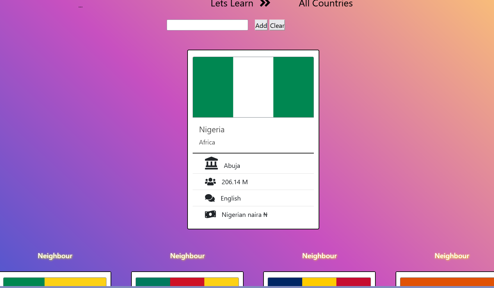
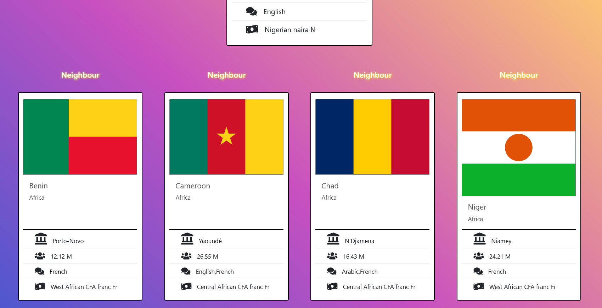

# 
#  :globe_with_meridians: Learning-Countries-App :globe_with_meridians:
> Learning countries app shows the capital city, population, official language and currency of the country you want to learn. You can also view list of neighboring countries!

## Table of contents
  - [Table of contents](#table-of-contents)
  - [General info](#general-info)
  - [Technologies](#technologies)
  - [Features](#features)
  - [How to use](#how-to-use)
  - [Screenshots](#screenshots)
  - [Contact](#contact)

## General info
This project is created to sharpen the knowledge of fetsching APi. As a tool Postman is also used in this project. It is a Project of The Clarusway IT School - Fullstack Developer Path.

## Technologies
* HTML
* CSS
* JavaScript

## Features
* Gives the card of the searched country with the capital city, population, official language and currency informations
* Another countries are also addable
* Shows the the neighbor countries in a list of cards

## How to use
Click on this [link](https://i-bilge.github.io/Learning-Countries-App/)

## Screenshots

## Contact
:mailbox_with_mail: You can send me email : iismailbilge@gmail.com :mailbox_with_mail:
